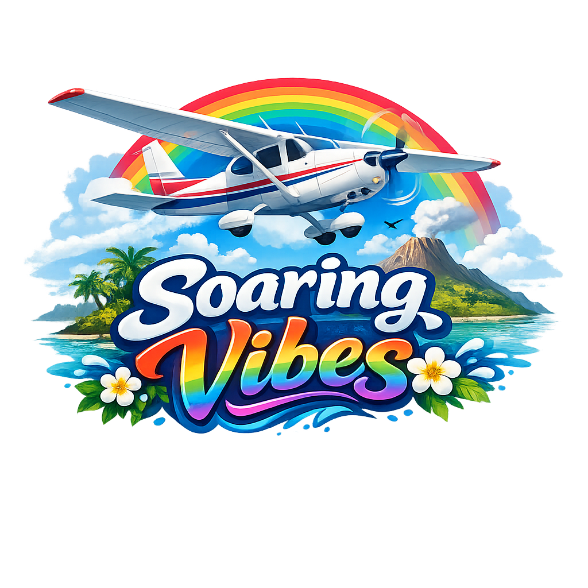

# Soaring Vibes - Android

A browser-based flight simulator featuring the Hawaiian islands, wrapped as a native Android app using Capacitor.

## Free Forever & Open Source

This project is **free forever** and **open source**. No paywalls, no premium features, no strings attached. Enjoy!

If you found this project compelling or useful and want to fuel the experiment, you can [buy me a coffee](https://ko-fi.com/tylereastman) ☕

## The Vibe-Coating Experiment

> *This entire project has been vibe coded.*

This flight simulator is an **agentic engineering experiment** to see just how complete a casual flight simulator can be created **without writing a single line of code manually** — only using prompts to steer the project.

Every line of code, every 3D model, the Cessna 182 aircraft, all palm trees and vegetation, every animation (propeller spin, control surfaces), the terrain, clouds, wildlife, airport buildings, and even this README — all of it was generated through AI prompts. Zero manual coding.

The models used were all locally hosted, primarily **Qwen3.5-27B** (with various smaller models) running on a home lab setup. All models are **open source**.

## Features

- **8 Hawaiian Islands**: Real heightmap terrain data from USGS 10m DEM
- **Dynamic Ocean**: Gerstner wave system with LOD levels
- **Cessna 182 Skylane**: Detailed aircraft with physics and animated propeller
- **Native Ecosystem**: Palm trees, native Hawaiian flora, marine animals, birds
- **Multiplayer**: WebSocket-based multiplayer support
- **Mobile Optimized**: Touch controls with throttle slider and virtual joystick

## Development

### Prerequisites

- Node.js 18+
- Android Studio
- Android SDK

### Setup

```bash
npm install
npx cap sync android
```

### Build APK

```bash
npm run android:build
```

This generates an APK at `android/app/build/outputs/apk/debug/app-debug.apk`

### Open in Android Studio

```bash
npm run android:open
```

### Development Workflow

1. Make changes to web assets in `www/`
2. Run `npx cap copy android` to sync
3. Open Android Studio and build

## Controls

### Desktop
- **W/S**: Pitch down/up
- **A/D**: Roll left/right
- **Q/E**: Yaw left/right
- **Shift/Ctrl**: Throttle up/down
- **Space**: Brake
- **R**: Reset aircraft
- **Mouse drag**: Orbit camera

### Mobile
- Left side: Throttle slider
- Right side: Virtual joystick for pitch/roll

## Links

- [Web Version](https://soaringvibes.com)
- [iOS App](https://github.com/tyler5673/soaringvibes-ios)
- [Main Repository](https://github.com/tyler5673/soaringVibes)

## License

MIT — do whatever you want. This is free forever.

---

*Built with prompts. Fueled by vibes. Powered by open source.*
